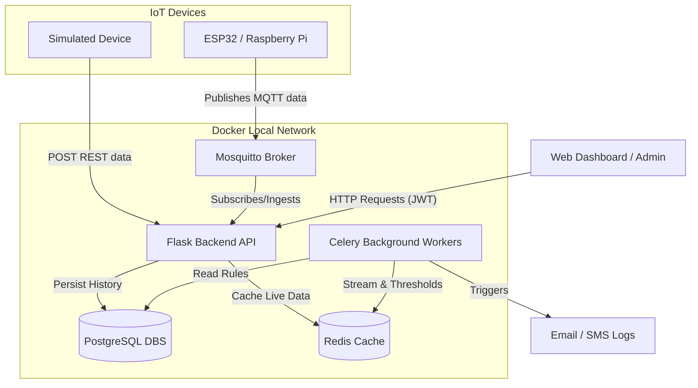
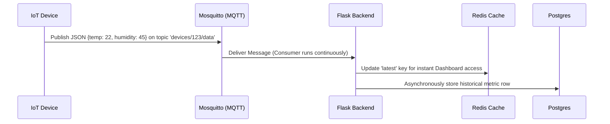

# System Architecture & Flow Diagram

This document illustrates the end-to-end communication flow of the IoT Device Monitoring platform. We use **Mermaid** graphs to visualize how devices, the Flask API, databases, and clients interact.

## 1. High-Level Architecture
Here is the high-level architecture mapped to our containerized services.

## 2. Request Flow: Device Registration vs Data Ingestion

### Device Registration (Admin/User)
1. **User logs in** and receives a JWT token.
2. User sends `POST /devices` with device details.
3. The **Flask API** validates the JWT, generates a unique `api_key` or identifier for the device, and stores it in **PostgreSQL**.
4. The system grants the physical device access to start transmitting.

### Real-Time Data Ingestion Flow

## 3. Tech Rationale
* **Why Flask?** Provides a clean, minimalistic framework perfectly suited for crafting specific REST APIs without unnecessary overhead.
* **Why MQTT?** IoT devices typically lack vast processing power. MQTT is extremely lightweight and ensures fast, low-bandwidth data telemetry out-of-the-box.
* **Why Redis?** When a dashboard needs to render "Live" metrics for hundreds of devices, reading direct from Postgres is slow. Redis acts as a lightning-fast memory store.
